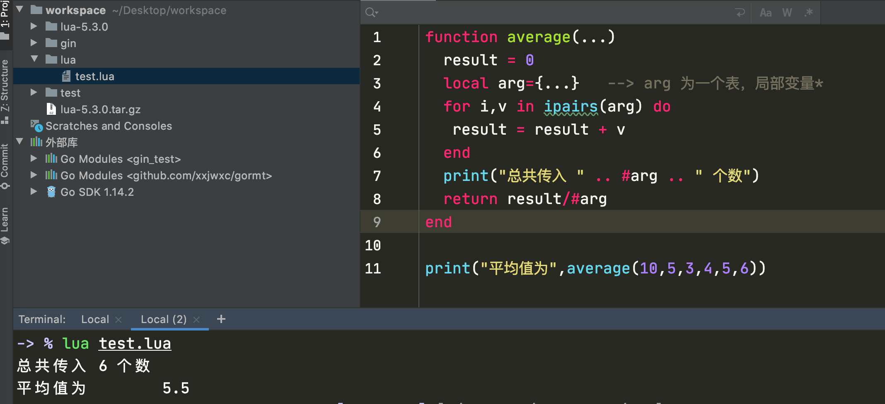

https://www.runoob.com/lua/lua-environment.html

# 安装

```
curl -R -O http://www.lua.org/ftp/lua-5.3.0.tar.gz
tar zxf lua-5.3.0.tar.gz
cd lua-5.3.0
make macosx test
make install
```

# 注视

单行注视 --

多行注视

--[[xxxxxx--]]


# 变量命名规则

- 标示符以一个字母 A 到 Z 或 a 到 z 或下划线 _ 开头后加上0个或多个字母，下划线，数字（0到9）
- 不能数字开头
- 不推荐_开头
- 区分大小写
- 不建议使用关键词

## 关键词

以下列出了 Lua 的保留关键字。保留关键字不能作为常量或变量或其他用户自定义标示符：

| and      | break | do    | else   |
| -------- | ----- | ----- | ------ |
| elseif   | end   | false | for    |
| function | if    | in    | local  |
| nil      | not   | or    | repeat |
| return   | then  | true  | until  |
| while    | goto  |       |        |

一般约定，以下划线开头连接一串大写字母的名字（比如 _VERSION）被保留用于 Lua 内部全局变量。

## 全局变量

在默认情况下，变量总是认为是全局的。

全局变量不需要声明，给一个变量赋值后即创建了这个全局变量，访问一个没有初始化的全局变量也不会出错，只不过得到的结果是：nil。

\> print(b)
nil
\> b=10
\> print(b)
10
\>

<font color=red>如果你想删除一个全局变量，只需要将变量赋值为nil。</font>

```
b = nil
print(b)      --> nil
```

这样变量b就好像从没被使用过一样。换句话说, 当且仅当一个变量不等于nil时，这个变量即存在。


# Lua 数据类型

Lua 是动态类型语言，变量不要类型定义,只需要为变量赋值。 值可以存储在变量中，作为参数传递或结果返回。

Lua 中有 8 个基本类型分别为：nil、boolean、number、string、userdata、function、thread 和 table。

| 数据类型 | 描述                                                         |
| :------- | :----------------------------------------------------------- |
| nil      | 这个最简单，只有值nil属于该类，表示一个无效值（在条件表达式中相当于false）。 |
| boolean  | 包含两个值：false和true。                                    |
| number   | 表示双精度类型的实浮点数                                     |
| string   | **字符串由一对双引号或单引号来表示**                         |
| function | 由 C 或 Lua 编写的函数                                       |
| userdata | 表示任意存储在变量中的C数据结构                              |
| thread   | 表示执行的独立线路，用于执行协同程序                         |
| table    | Lua 中的表（table）其实是一个"关联数组"（associative arrays），数组的索引可以是数字、字符串或表类型。在 Lua 里，table 的创建是通过"构造表达式"来完成，最简单构造表达式是{}，用来创建一个空表。 |

我们可以使用 type 函数测试给定变量或者值的类型：

## 实例

```
print(type("Hello world"))    *--> string*
print(type(10.4*3))       *--> number*
print(type(print))        *--> function*
print(type(type))        *--> function*
print(type(true))        *--> boolean*
print(type(nil))         *--> nil*
print(type(type(X)))       *--> string*
```


------

## nil（空）

nil 类型表示一种没有任何有效值，它只有一个值 -- nil，例如打印一个没有赋值的变量，便会输出一个 nil 值：

```
> print(type(a))
nil
>
```

==对于全局变量和 table，nil 还有一个"删除"作用==，给全局变量或者 table 表里的变量赋一个 nil 值，等同于把它们删掉，执行下面代码就知：

tab1 = { key1 = "val1", key2 = "val2", "val3" }
**for** k, v **in** pairs(tab1) **do**
  print(k .. " - " .. v)
**end**

tab1.key1 = nil
**for** k, v **in** pairs(tab1) **do**
  print(k .. " - " .. v)
**end**

### nil 作比较时应该加上双引号 **"**：

```
\> type(X)
nil
\> type(X)==nil
false
\> type(X)=="nil"
true
\>
```


**type(X)==nil** 结果为 **false** 的原因是因为 **type(type(X))==string**。

------

## boolean（布尔）

==boolean 类型只有两个可选值：true（真） 和 false（假），Lua 把 false 和 nil 看作是 false，其他的都为 true，数字 0 也是 true:==

## 实例

```
print(type(true))
print(type(false))
print(type(nil))

if false or nil then
  print("至少有一个是 true")
else
  print("false 和 nil 都为 false")
end

if 0 then
  print("数字 0 是 true")
else
  print("数字 0 为 false")
end
```


以上代码执行结果如下：

```
$ lua test.lua 
boolean
boolean
nil
false 和 nil 都为 false
数字 0 是 true
```

------

## number（数字）

Lua 默认只有一种 number 类型 -- double（双精度）类型（默认类型可以修改 luaconf.h 里的定义），以下几种写法都被看作是 number 类型：

## 实例

```
print(type(2))
print(type(2.2))
print(type(0.2))
print(type(2e+1))
print(type(0.2e-1))
print(type(7.8263692594256e-06))

```


[运行实例 »](https://www.runoob.com/try/runcode.php?filename=datatype1&type=lua)

以上代码执行结果：

```
number
number
number
number
number
number
```

------

## string（字符串）

==字符串由一对双引号或单引号来表示。==

```
string1 = "this is string1"
string2 = 'this is string2'
```

也可以用 2 个方括号 "[[]]" 来表示"一块"字符串。

## 实例

```
html = [[
<html>
<head></head>
<body>
    <a href="http://www.runoob.com/">菜鸟教程</a>
</body>
</html>
]]
print(html)
```

以下代码执行结果为：

```
<html>
<head></head>
<body>
    <a href="http://www.runoob.com/">菜鸟教程</a>
</body>
</html>
```

==在对一个数字字符串上进行算术操作时，Lua 会尝试将这个数字字符串转成一个数字:==

\> print("2" + 6)
8.0
\> print("2" + "6")
8.0
\> print("2 + 6")
2 + 6
\> print("-2e2" * "6")
-1200.0
\> print("error" + 1)
stdin:1: attempt to perform arithmetic on a string value
stack traceback:
    stdin:1: **in** main chunk
    [C]: **in** ?
\>

以上代码中"error" + 1执行报错了，==字符串连接使用的是 .. ==，如：

```
> print("a" .. 'b')
ab
> print(157 .. 428)
157428
> 
```

==使用 # 来计算字符串的长度==，放在字符串前面，如下实例：

## 实例

```
\> len = "www.runoob.com"
\> print(#len)
14
\> print(#"www.runoob.com")
14
\>
```


------

## table（表）

在 Lua 里，table 的创建是通过"构造表达式"来完成，最简单构造表达式是{}，用来创建一个空表。也可以在表里添加一些数据，直接初始化表:

### 实例

```
*-- 创建一个空的 table*
**local** tbl1 = {}
 
*-- 直接初始表*
**local** tbl2 = {"apple", "pear", "orange", "grape"}

Lua 中的表（table）其实是一个"关联数组"（associative arrays），数组的索引可以是数字或者是字符串。
```

### 实例

```
*-- table_test.lua 脚本文件*
a = {}
a["key"] = "value"
key = 10
a[key] = 22
a[key] = a[key] + 11
**for** k, v **in** pairs(a) **do**
  print(k .. " : " .. v)
**end**
```


脚本执行结果为：

```
$ lua table_test.lua 
key : value
10 : 33
```


### 实例

不同于其他语言的数组把 0 作为数组的初始索引，在 Lua 里表的默认初始索引一般以 1 开始。

```
-- table_test2.lua 脚本文件*
local tbl = {"apple", "pear", "orange", "grape"}
for key, val in pairs(tbl) do
  print("Key", key)
end
```


脚本执行结果为：

```
$ lua table_test2.lua 
Key    1
Key    2
Key    3
Key    4
```

==table 不会固定长度大小，有新数据添加时 table 长度会自动增长，没初始的 table 都是 nil。==

### 实例

```
-- table_test3.lua 脚本文件*
a3 = {}
for i = 1, 10 do
  a3[i] = i
end
a3["key"] = "val"
print(a3["key"])
print(a3["none"])
print(a3[1])
print(a3[5])
```


脚本执行结果为：

```
$ lua table_test3.lua 
val
nil
```

-- table_test3.lua 脚本文件*
a3 = {}
for i = 1, 10 do
  a3[i] = i
end
a3["key"] = "val"
print(a3["key"])
print(a3["none"])
print(a3[1])
print(a3[5])

------


## function（函数）

在 Lua 中，函数是被看作是"第一类值（First-Class Value）"，函数可以存在变量里:

### 实例

```
-- function_test.lua 脚本文件*
function factorial1(n)
  if n == 0 then
    return 1
  else
    return n * factorial1(n - 1)
  end
end
print(factorial1(5))
factorial2 = factorial1
print(factorial2(5))
```


脚本执行结果为：

```
$ lua function_test.lua 
120
120
```

function 可以以匿名函数（anonymous function）的方式通过参数传递:


### 实例

```
-- function_test2.lua 脚本文件*
function testFun(tab,fun)
    for k ,v in pairs(tab) do
        print(fun(k,v));
    end
end


tab={key1="val1",key2="val2"};
testFun(tab,
function(key,val) --匿名函数
    return key.."="..val;
end
);
```


脚本执行结果为：

```
$ lua function_test2.lua 
key1 = val1
key2 = val2
```


## thread（线程）

在 Lua 里，最主要的线程是协同程序（coroutine）。它跟线程（thread）差不多，拥有自己独立的栈、局部变量和指令指针，可以跟其他协同程序共享全局变量和其他大部分东西。

线程跟协程的区别：线程可以同时多个运行，而协程任意时刻只能运行一个，并且处于运行状态的协程只有被挂起（suspend）时才会暂停。

------

## userdata（自定义类型）

userdata 是一种用户自定义数据，用于表示一种由应用程序或 C/C++ 语言库所创建的类型，可以将任意 C/C++ 的任意数据类型的数据（通常是 struct 和 指针）存储到 Lua 变量中调用。


# Lua 变量

==变量在使用前，必须在代码中进行声明，即创建该变量。==

编译程序执行代码之前编译器需要知道如何给语句变量开辟存储区，用于存储变量的值。

Lua 变量有三种类型：全局变量、局部变量、表中的域。

<font color = red>Lua 中的变量全是全局变量，那怕是语句块或是函数里，除非用 local 显式声明为局部变量。</font>

局部变量的作用域为从声明位置开始到所在语句块结束。

**变量的默认值均为 nil。**

### 实例

```
-- test.lua 文件脚本*
a = 5        -- 全局变量*
local b = 5     -- 局部变量*

function joke()
  c = 5      -- 全局变量*
  local d = 6   -- 局部变量*
end

joke()
print(c,d)      --> 5 nil*

do
  local a = 6   -- 局部变量*
  b = 6      -- 对局部变量重新赋值*
  print(a,b);   --> 6 6*
end

print(a,b)    --> 5 6*
```

执行以上实例输出结果为：

```
$ lua test.lua 
5    nil
6    6
5    6
```


## 赋值语句

赋值是改变一个变量的值和改变表域的最基本的方法。

```
a = "hello" .. "world"
t.n = t.n + 1
```

Lua 可以对多个变量同时赋值，变量列表和值列表的各个元素用逗号分开，赋值语句右边的值会依次赋给左边的变量。

```
a, b = 10, 2*x       <-->       a=10; b=2*x
```

遇到赋值语句Lua会先计算右边所有的值然后再执行赋值操作，所以我们可以这样进行交换变量的值：

```
x, y = y, x                     -- swap 'x' for 'y'
a[i], a[j] = a[j], a[i]         -- swap 'a[i]' for 'a[j]'
```

当变量个数和值的个数不一致时，Lua会一直以变量个数为基础采取以下策略：

```
a. 变量个数 > 值的个数             按变量个数补足nil
b. 变量个数 < 值的个数             多余的值会被忽略
```

## 实例

```lua
a, b, c = 0, 1
print(a,b,c)       --> 0  1  nil*

a, b = a+1, b+1, b+2   -- value of b+2 is ignored*
print(a,b)        --> 1  2*

a, b, c = 0
print(a,b,c)       --> 0  nil  nil*
```

上面最后一个例子是一个常见的错误情况，注意：如果要对多个变量赋值必须依次对每个变量赋值。

```
a, b, c = 0, 0, 0
print(a,b,c)             --> 0   0   0
```


多值赋值经常用来交换变量，或将函数调用返回给变量：

```
a, b = f()
```

f()返回两个值，第一个赋给a，第二个赋给b。

应该尽可能的使用局部变量，有两个好处：

- 1. 避免命名冲突。
- 2. 访问局部变量的速度比全局变量更快。

------

## 索引

对 table 的索引使用方括号 []。Lua 也提供了 . 操作。

```
t[i]
t.i                 -- 当索引为字符串类型时的一种简化写法
gettable_event(t,i) -- 采用索引访问本质上是一个类似这样的函数调用
```

## 实例

```
 site = {}
 site["key"] = "www.runoob.com"
 site[2] = "www.222.com"
 print(site["key"])
--www.runoob.com
 print(site.key)
 --print(site.2) 数字是不可以的
--www.runoob.com
```


# 循环

# while 循环

[ Lua 循环](https://www.runoob.com/lua/lua-loops.html)

Lua 编程语言中 while 循环语句在判断条件为 true 时会重复执行循环体语句。

### 语法

Lua 编程语言中 while 循环语法：

```
while(condition)
do
   statements
end
```

### 实例

以下实例循环输出 a 的值：

### 实例

```
a=10
while( a < 20 ) do
  print("a 的值为:", a)
  a = a+1
end
```


执行以上代码，输出结果如下：

```
a 的值为:    10
a 的值为:    11
a 的值为:    12
a 的值为:    13
a 的值为:    14
a 的值为:    15
a 的值为:    16
a 的值为:    17
a 的值为:    18
a 的值为:    19
```


## for 循环

Lua 编程语言中数值for循环语法格式:

```
for var=exp1,exp2,exp3 do  
    <执行体>  
end  
```

var 从 exp1 变化到 exp2，每次变化以 exp3 为步长递增 var，并执行一次 **"执行体"**。exp3 是可选的，如果不指定，默认为1。

### 实例

```
 -- for i=1,f(x) do
--   print(i)
-- end

for i=10,1,-1 do
  print(i)
end

--#!/usr/local/bin/lua
function f(x)
    print("function")
    return x*2
end
for i=1,f(5) do print(i)
end
```


for的三个表达式在循环开始前一次性求值，以后不再进行求值。比如上面的f(x)只会在循环开始前执行一次，其结果用在后面的循环中。

验证如下:

## 实例

\#!/usr/**local**/bin/lua  
**function** f(x) 
  print("function") 
  **return** x*2 
**end** 
**for** i=1,f(5) **do** print(i) 
**end**

以上实例输出结果为：

```
function
1
2
3
4
5
6
7
8
9
10
```

可以看到 函数f(x)只在循环开始前执行一次。


## 泛型for循环

泛型 for 循环通过一个迭代器函数来遍历所有值，类似 java 中的 foreach 语句。

Lua 编程语言中泛型 for 循环语法格式:

```
--打印数组a的所有值  
a = {"one", "two", "three"}
for i, v in ipairs(a) do
    print(i, v)
end 
```

i是数组索引值，v是对应索引的数组元素值。ipairs是Lua提供的一个迭代器函数，用来迭代数组。

### 实例

循环数组 days：

## 实例

\#!/usr/**local**/bin/lua  
days = {"Sunday","Monday","Tuesday","Wednesday","Thursday","Friday","Saturday"} 
**for** i,v **in** ipairs(days) **do** print(v) **end** 

以上实例输出结果为：

```
Sunday
Monday
Tuesday
Wednesday
Thursday
Friday
Saturday
```

# Lua repeat...until 循环

[ Lua 循环](https://www.runoob.com/lua/lua-loops.html)

Lua 编程语言中 repeat...until 循环语句不同于 for 和 while循环，for 和 while 循环的条件语句在当前循环执行开始时判断，而 repeat...until 循环的条件语句在当前循环结束后判断。

### 实例

相当于do while

```
--[ 变量定义 --]*
a = 10
--[ 执行循环 --]*
repeat
  print("a的值为:", a)
  a = a + 1
until( a > 15 )
```


执行以上代码，程序输出结果为：

```
a的值为:    10
a的值为:    11
a的值为:    12
a的值为:    13
a的值为:    14
a的值为:    15
```

# ==流程控制--------------==

## if

只有 false 和nil 为false

```
--[ 0 为 true ]*
if(0)
then
  print("0 为 true")
end
```


以上代码输出结果为：

```
0 为 true
```

## if...else 语句

Lua if 语句可以与 else 语句搭配使用, 在 if 条件表达式为 false 时执行 else 语句代码块。

Lua if...else 语句语法格式如下：

```
if(布尔表达式)
then
   --[ 布尔表达式为 true 时执行该语句块 --]
else
   --[ 布尔表达式为 false 时执行该语句块 --]
end
```

```
--[ 定义变量 --]*
a = 100;
--[ 检查条件 --]*
if( a < 20 )
then
  --[ if 条件为 true 时执行该语句块 --]*
  print("a 小于 20" )
else
  --[ if 条件为 false 时执行该语句块 --]*
  print("a 大于 20" )
end
print("a 的值为 :", a)
```

以上代码执行结果如下：

```
a 大于 20
a 的值为 :    100
```


## if...elseif...else 语句

Lua if 语句可以与 elseif...else 语句搭配使用, 在 if 条件表达式为 false 时执行 elseif...else 语句代码块，用于检测多个条件语句。

Lua if...elseif...else 语句语法格式如下：

```
if( 布尔表达式 1)
then
   --[ 在布尔表达式 1 为 true 时执行该语句块 --]

elseif( 布尔表达式 2)
then
   --[ 在布尔表达式 2 为 true 时执行该语句块 --]

elseif( 布尔表达式 3)
then
   --[ 在布尔表达式 3 为 true 时执行该语句块 --]
else 
   --[ 如果以上布尔表达式都不为 true 则执行该语句块 --]
end
```

### 实例

以下实例对变量 a 的值进行判断：

## 实例

```
--[ 定义变量 --]*
a = 100

--[ 检查布尔条件 --]*
if( a == 10 )
then
  --[ 如果条件为 true 打印以下信息 --]*
  print("a 的值为 10" )
elseif( a == 20 )
then
  --[ if else if 条件为 true 时打印以下信息 --]*
  print("a 的值为 20" )
elseif( a == 30 )
then
  --[ if else if condition 条件为 true 时打印以下信息 --]*
  print("a 的值为 30" )
else
  --[ 以上条件语句没有一个为 true 时打印以下信息 --]*
  print("没有匹配 a 的值" )
end
print("a 的真实值为: ", a )
```


以上代码执行结果如下：

```
没有匹配 a 的值
a 的真实值为:     100
```

# ==Lua 函数------------------==

### 函数定义

Lua 编程语言函数定义格式如下：

```
optional_function_scope function function_name( argument1, argument2, argument3..., argumentn)
    function_body
    return result_params_comma_separated
end
```

解析：

- **optional_function_scope:** 该参数是可选的制定函数是全局函数还是局部函数，未设置该参数默认为全局函数，如果你需要设置函数为局部函数需要使用关键字 **local**。

- **function_name:** 指定函数名称。

- **argument1, argument2, argument3..., argumentn:** 函数参数，多个参数以逗号隔开，函数也可以不带参数。

- **function_body:** 函数体，函数中需要执行的代码语句块。

- **result_params_comma_separated:** 函数返回值，Lua语言函数可以返回多个值，每个值以逗号隔开。

- ### 实例

- 以下实例定义了函数 **max()**，参数为 num1, num2，用于比较两值的大小，并返回最大值：

- ## 实例

- ```
  --[[ 函数返回两个值的最大值 --]]
  function max(num1, num2)
    if (num1 > num2) then
     result = num1;
    else
     result = num2;
    end
    return result;
  end
  -- 调用函数*
  print("两值比较最大值为 ",max(10,4))
  print("两值比较最大值为 ",max(5,6))
  
  
  ```

- 以上代码执行结果为：

- ```
  两值比较最大值为     10
  两值比较最大值为     6
  ```

- 

- **Lua 中我们可以将函数作为参数传递给函数，如下实例：**

- ## 实例

- ```
  myprint = function(param)
    print("这是打印函数 -  ##",param,"##")
  end
  
  function add(num1,num2,functionPrint)
    result = num1 + num2
    -- 调用传递的函数参数*
    functionPrint(result)
  end
  myprint(10)
  -- myprint 函数作为参数传递*
  add(2,5,myprint)
  ```

- 以上代码执行结果为：

- ```
  这是打印函数 -   ##    10    ##
  这是打印函数 -   ##    7    ##
  ```

- 

- ## 多返回值

- Lua函数可以返回多个结果值，比如string.find，其返回匹配串"开始和结束的下标"（如果不存在匹配串返回nil）。

- ```
  > s, e = string.find("www.runoob.com", "runoob") 
  > print(s, e)
  5    10
  ```

- Lua函数中，在return后列出要返回的值的列表即可返回多值，如：

- ## 实例

- ```
  function maximum (a)
    local mi = 1       -- 最大值索引*
    local m = a[mi]      -- 最大值*
    for i,val in ipairs(a) do
      if val > m then
        mi = i
        m = val
      end
    end
    return m, mi
  end
  
  print(maximum({8,10,23,12,5}))
  ```

- 

- 以上代码执行结果为：

- ```
  23    3
  ```

- ------

- 

- ## 可变参数

- Lua 函数可以接受可变数目的参数，和 C 语言类似，在函数参数列表中使用三点 **...** 表示函数有可变的参数。

- ```
  function add(...)  
  local s = 0  
    for i, v in ipairs{...} do   --> {...} 表示一个由所有变长参数构成的数组  
      s = s + v  
    end  
    return s  
  end  
  print(add(3,4,5,6,7))  --->25
  ```

- 我们可以将可变参数赋值给一个变量。

- 例如，我们计算几个数的平均值：

- ## 实例

- ```
  function average(...)
    result = 0
    local arg={...}   --> arg ==为一个表，局部变量==
    for i,v in ipairs(arg) do
     result = result + v
    end
    print("总共传入 " .. #arg .. " 个数")
    return result/#arg
  end
  
  print("平均值为",average(10,5,3,4,5,6))
  ```

- 以上代码执行结果为：

- ```
  总共传入 6 个数
  平均值为    5.5
  ```

- **我们也可以通过 select("#",...) 来获取可变参数的数量:**

- 

- ## 实例

- **function** fwrite(fmt, ...) *---> 固定的参数fmt*
    **return** io.write(string.format(fmt, ...))   
  **end**

- fwrite("runoob**\n**")    *--->fmt = "runoob", 没有变长参数。*  
  fwrite("%d%d**\n**", 1, 2)  *--->fmt = "%d%d", 变长参数为 1 和 2*

- 输出结果为：

- ```
  runoob
  12
  ```

- 通常在遍历变长参数的时候只需要使用 **{…}**，然而变长参数可能会包含一些 **nil**，那么就可以用 **select** 函数来访问变长参数了：**select('#', …)** 或者 **select(n, …)**

- - **select('#', …)** 返回可变参数的长度
  - **select(n, …)** 用于返回 **n** 到 **select('#',…)** 的参数


- 调用select时，必须传入一个固定实参selector(选择开关)和一系列变长参数。如果selector为数字n,那么select返回它的第n个可变实参，否则只能为字符串"#",这样select会返回变长参数的总数。例子代码：

- ```
  do
    function foo(...)
      for i = 1, select('#', ...) do -->获取参数总数*
        local arg = select(i, ...); -->读取参数*
        print("arg", arg); 
      end
    end
  
    foo(1, 2, 3, 4); 
  end
  ```

- 

- 输出结果为：

- ```
  arg    1
  arg    2
  arg    3
  arg    4
  ```


# ==运算符--------------==

## 算术运算符

下表列出了 Lua 语言中的常用算术运算符，设定 A 的值为10，B 的值为 20：

| 操作符 | 描述 | 实例               |
| :----- | :--- | :----------------- |
| +      | 加法 | A + B 输出结果 30  |
| -      | 减法 | A - B 输出结果 -10 |
| *      | 乘法 | A * B 输出结果 200 |
| /      | 除法 | B / A w输出结果 2  |
| %      | 取余 | B % A 输出结果 0   |
| ^      | 乘幂 | A^2 输出结果 100   |
| -      | 负号 | -A 输出结果 -10    |

我们可以通过以下实例来更加透彻的理解算术运算符的应用：

## 实例

a = 21
b = 10
c = a + b
print("Line 1 - c 的值为 ", c )
c = a - b
print("Line 2 - c 的值为 ", c )
c = a * b
print("Line 3 - c 的值为 ", c )
c = a / b
print("Line 4 - c 的值为 ", c )
c = a % b
print("Line 5 - c 的值为 ", c )
c = a^2
print("Line 6 - c 的值为 ", c )
c = -a
print("Line 7 - c 的值为 ", c )

以上程序执行结果为：

```
Line 1 - c 的值为     31
Line 2 - c 的值为     11
Line 3 - c 的值为     210
Line 4 - c 的值为     2.1
Line 5 - c 的值为     1
Line 6 - c 的值为     441
Line 7 - c 的值为     -21
```

## 关系运算符

下表列出了 Lua 语言中的常用关系运算符，设定 A 的值为10，B 的值为 20：

| 操作符 | 描述                                                         | 实例                  |
| :----- | :----------------------------------------------------------- | :-------------------- |
| ==     | 等于，检测两个值是否相等，相等返回 true，否则返回 false      | (A == B) 为 false。   |
| ~=     | 不等于，检测两个值是否相等，相等返回 false，否则返回 true    | (A ~= B) 为 true。    |
| >      | 大于，如果左边的值大于右边的值，返回 true，否则返回 false    | (A > B) 为 false。    |
| <      | 小于，如果左边的值大于右边的值，返回 false，否则返回 true    | (A < B) 为 true。     |
| >=     | 大于等于，如果左边的值大于等于右边的值，返回 true，否则返回 false | (A >= B) 返回 false。 |
| <=     | 小于等于， 如果左边的值小于等于右边的值，返回 true，否则返回 false | (A <= B) 返回 true。  |


我们可以通过以下实例来更加透彻的理解关系运算符的应用：

## 实例

```
a = 21
b = 10

if( a == b )
then
  print("Line 1 - a 等于 b" )
else
  print("Line 1 - a 不等于 b" )
end

if( a ~= b )
then
  print("Line 2 - a 不等于 b" )
else
  print("Line 2 - a 等于 b" )
end

if ( a < b )
then
  print("Line 3 - a 小于 b" )
else
  print("Line 3 - a 大于等于 b" )
end

if ( a > b )
then
  print("Line 4 - a 大于 b" )
else
  print("Line 5 - a 小于等于 b" )
end

-- 修改 a 和 b 的值*
a = 5
b = 20
if ( a <= b )
then
  print("Line 5 - a 小于等于  b" )
end

if ( b >= a )
then
  print("Line 6 - b 大于等于 a" )
end
```


以上程序执行结果为：

```
Line 1 - a 不等于 b
Line 2 - a 不等于 b
Line 3 - a 大于等于 b
Line 4 - a 大于 b
Line 5 - a 小于等于  b
Line 6 - b 大于等于 a
```

## 逻辑运算符

下表列出了 Lua 语言中的常用逻辑运算符，设定 A 的值为 true，B 的值为 false：

| 操作符 | 描述                                                         | 实例                   |
| :----- | :----------------------------------------------------------- | :--------------------- |
| and    | 逻辑与操作符。 若 A 为 false，则返回 A，否则返回 B。         | (A and B) 为 false。   |
| or     | 逻辑或操作符。 若 A 为 true，则返回 A，否则返回 B。          | (A or B) 为 true。     |
| not    | 逻辑非操作符。与逻辑运算结果相反，如果条件为 true，逻辑非为 false。 | not(A and B) 为 true。 |

我们可以通过以下实例来更加透彻的理解逻辑运算符的应用：

## 实例

```
a = true
b = true

if ( a and b )
then
  print("a and b - 条件为 true" )
end

if ( a or b )
then
  print("a or b - 条件为 true" )
end

print("---------分割线---------" )

-- 修改 a 和 b 的值*
a = false
b = true

if ( a and b )
then
  print("a and b - 条件为 true" )
else
  print("a and b - 条件为 false" )
end

if ( not( a and b) )
then
  print("not( a and b) - 条件为 true" )
else
  print("not( a and b) - 条件为 false" )
end
```


以上程序执行结果为：

```
a and b - 条件为 true
a or b - 条件为 true
---------分割线---------
a and b - 条件为 false
not( a and b) - 条件为 true
```

------

## 其他运算符

下表列出了 Lua 语言中的连接运算符与计算表或字符串长度的运算符：

| 操作符 | 描述                               | 实例                                                         |
| :----- | :--------------------------------- | :----------------------------------------------------------- |
| ..     | 连接两个字符串                     | a..b ，其中 a 为 "Hello " ， b 为 "World", 输出结果为 "Hello World"。 |
| #      | 一元运算符，返回字符串或表的长度。 | #"Hello" 返回 5                                              |


我们可以通过以下实例来更加透彻的理解连接运算符与计算表或字符串长度的运算符的应用：

## 实例

```
a = "Hello "
b = "World"

print("连接字符串 a 和 b ", a..b )

print("b 字符串长度 ",#b )

print("字符串 Test 长度 ",#"Test" )

print("菜鸟教程网址长度 ",#"www.runoob.com" )

以上程序执行结果为：
```


```
连接字符串 a 和 b     Hello World
b 字符串长度     5
字符串 Test 长度     4
菜鸟教程网址长度     14
```

------

## 运算符优先级

从高到低的顺序：

```
^
not    - (unary)
*      /
+      -
..
<      >      <=     >=     ~=     ==
and
or
```

除了 **^** 和 **..** 外所有的二元运算符都是左连接的。

```
a+i < b/2+1          <-->       (a+i) < ((b/2)+1)
5+x^2*8              <-->       5+((x^2)*8)
a < y and y <= z     <-->       (a < y) and (y <= z)
-x^2                 <-->       -(x^2)
x^y^z                <-->       x^(y^z)
```


我们可以通过以下实例来更加透彻的了解 Lua 语言运算符的优先级：

## 实例

a = 20
b = 10
c = 15
d = 5

e = (a + b) * c / d;*-- ( 30 \* 15 ) / 5*
print("(a + b) * c / d 运算值为  :",e )

e = ((a + b) * c) / d; *-- (30 \* 15 ) / 5*
print("((a + b) * c) / d 运算值为 :",e )

e = (a + b) * (c / d);*-- (30) \* (15/5)*
print("(a + b) * (c / d) 运算值为 :",e )

e = a + (b * c) / d; *-- 20 + (150/5)*
print("a + (b * c) / d 运算值为  :",e )

以上程序执行结果为：

```
(a + b) * c / d 运算值为  :    90.0
((a + b) * c) / d 运算值为 :    90.0
(a + b) * (c / d) 运算值为 :    90.0
a + (b * c) / d 运算值为   :    50.0
```

# ==Lua 字符串---------==

字符串或串(String)是由数字、字母、下划线组成的一串字符。

Lua 语言中字符串可以使用以下三种方式来表示：

- 单引号间的一串字符。
- 双引号间的一串字符。
- **[[** 与 **]]** 间的一串字符。

以上三种方式的字符串实例如下：

## 命名规则

```
string1 = "Lua"
print("\"字符串 1 是\"",string1)
string2 = 'runoob.com'
print("字符串 2 是",string2)

string3 = [["Lua 教程"]]
print("字符串 3 是",string3)

```

```
"字符串 1 是"    Lua
字符串 2 是    runoob.com
字符串 3 是    "Lua 教程"
```

转义字符用于表示不能直接显示的字符，比如后退键，回车键，等。如在字符串转换双引号可以使用 "\""。

所有的转义字符和所对应的意义：

| 转义字符 | 意义                                | ASCII码值（十进制） |
| -------- | ----------------------------------- | ------------------- |
| \a       | 响铃(BEL)                           | 007                 |
| \b       | 退格(BS) ，将当前位置移到前一列     | 008                 |
| \f       | 换页(FF)，将当前位置移到下页开头    | 012                 |
| \n       | 换行(LF) ，将当前位置移到下一行开头 | 010                 |
| \r       | 回车(CR) ，将当前位置移到本行开头   | 013                 |
| \t       | 水平制表(HT) （跳到下一个TAB位置）  | 009                 |
| \v       | 垂直制表(VT)                        | 011                 |
| \\       | 代表一个反斜线字符''\'              | 092                 |
| \'       | 代表一个单引号（撇号）字符          | 039                 |
| \"       | 代表一个双引号字符                  | 034                 |
| \0       | 空字符(NULL)                        | 000                 |
| \ddd     | 1到3位八进制数所代表的任意字符      | 三位八进制          |
| \xhh     | 1到2位十六进制所代表的任意字符      | 二位十六进制        |

## 字符串操作

Lua 提供了很多的方法来支持字符串的操作：

| 序号 | 方法 & 用途                                                  |
| :--- | :----------------------------------------------------------- |
| 1    | **string.upper(argument):** 字符串全部转为大写字母。         |
| 2    | **string.lower(argument):** 字符串全部转为小写字母。         |
| 3    | **string.gsub(mainString,findString,replaceString,num)**在字符串中替换。mainString 为要操作的字符串， findString 为被替换的字符，replaceString 要替换的字符，num 替换次数（可以忽略，则全部替换），如：`> string.gsub("aaaa","a","z",3); zzza  3` |
| 4    | **string.find (str, substr, [init, [end]])** 在一个指定的目标字符串中搜索指定的内容(第三个参数为索引),返回其具体位置。不存在则返回 nil。`> string.find("Hello Lua user", "Lua", 1)  7  9` |
| 5    | **string.reverse(arg)** 字符串反转`> string.reverse("Lua") auL` |
| 6    | **string.format(...)** 返回一个类似printf的格式化字符串`> string.format("the value is:%d",4) the value is:4` |
| 7    | **string.char(arg) 和 string.byte(arg[,int])** char 将整型数字转成字符并连接， byte 转换字符为整数值(可以指定某个字符，默认第一个字符)。`> string.char(97,98,99,100) abcd > string.byte("ABCD",4) 68 > string.byte("ABCD") 65 >` |
| 8    | **string.len(arg)** 计算字符串长度。`string.len("abc") 3`    |
| 9    | **string.rep(string, n)** 返回字符串string的n个拷贝`> string.rep("abcd",2) abcdabcd` |
| 10   | **..** 链接两个字符串`> print("www.runoob.".."com") www.runoob.com` |
| 11   | **string.gmatch(str, pattern)** 回一个迭代器函数，每一次调用这个函数，返回一个在字符串 str 找到的下一个符合 pattern 描述的子串。如果参数 pattern 描述的字符串没有找到，迭代函数返回nil。`> for word in string.gmatch("Hello Lua user", "%a+") do print(word) end Hello Lua user` |
| 12   | **string.match(str, pattern, init)** string.match()只寻找源字串str中的第一个配对. 参数init可选, 指定搜寻过程的起点, 默认为1。 在成功配对时, 函数将返回配对表达式中的所有捕获结果; 如果没有设置捕获标记, 则返回整个配对字符串. 当没有成功的配对时, 返回nil。`> = string.match("I have 2 questions for you.", "%d+ %a+") 2 questions > = string.format("%d, %q", string.match("I have 2 questions for you.", "(%d+) (%a+)")) 2, "questions"` |

## 字符串截取

字符串截取使用 sub() 方法。

string.sub() 用于截取字符串，原型为：

```
string.sub(s, i [, j])
```

参数说明：

- s：要截取的字符串。
- i：截取开始位置。
- j：截取结束位置，默认为 -1，最后一个字符。

```
-- 字符串
local sourcestr = "prefix--runoobgoogletaobao--suffix"
  print("\n原始字符串", string.format("%q", sourcestr))

-- 截取部分，第4个到第15个
local first_sub = string.sub(sourcestr, 4, 15)
print("\n第一次截取", string.format("%q", first_sub))

-- 取字符串前缀，第1个到第8个
local second_sub = string.sub(sourcestr, 1, 8)
print("\n第二次截取", string.format("%q", second_sub))

-- 截取最后10个
local third_sub = string.sub(sourcestr, -10)
print("\n第三次截取", string.format("%q", third_sub))

-- 索引越界，输出原始字符串
local fourth_sub = string.sub(sourcestr, -100)
print("\n第四次截取", string.format("%q", fourth_sub))
```

以上代码执行结果为：

```
原始字符串    "prefix--runoobgoogletaobao--suffix"

第一次截取    "fix--runoobg"

第二次截取    "prefix--"

第三次截取    "ao--suffix"

第四次截取    "prefix--runoobgoogletaobao--suffix"
```

## 字符串大小写转换

以下实例演示了如何对字符串大小写进行转换：

```
string1 = "Lua";
print(string.upper(string1))
print(string.lower(string1))

以上代码执行结果为：
```

```
LUA
lua
```

## 字符串查找与反转

以下实例演示了如何对字符串进行查找与反转操作：

```
string = "Lua Tutorial"
*-- 查找字符串*
print(string.find(string,"Tutorial"))
reversedString = string.reverse(string)
print("新字符串为",reversedString)

以上代码执行结果为：
```

```
5    12
新字符串为    lairotuT auL
```

## 字符串格式化

Lua 提供了 **string.format()** 函数来生成具有特定格式的字符串, 函数的第一个参数是格式 , 之后是对应格式中每个代号的各种数据。

由于格式字符串的存在, 使得产生的长字符串可读性大大提高了。这个函数的格式很像 C 语言中的 printf()。

以下实例演示了如何对字符串进行格式化操作：

格式字符串可能包含以下的转义码:

- %c - 接受一个数字, 并将其转化为ASCII码表中对应的字符
- %d, %i - 接受一个数字并将其转化为有符号的整数格式
- %o - 接受一个数字并将其转化为八进制数格式
- %u - 接受一个数字并将其转化为无符号整数格式
- %x - 接受一个数字并将其转化为十六进制数格式, 使用小写字母
- %X - 接受一个数字并将其转化为十六进制数格式, 使用大写字母
- %e - 接受一个数字并将其转化为科学记数法格式, 使用小写字母e
- %E - 接受一个数字并将其转化为科学记数法格式, 使用大写字母E
- %f - 接受一个数字并将其转化为浮点数格式
- %g(%G) - 接受一个数字并将其转化为%e(%E, 对应%G)及%f中较短的一种格式
- %q - 接受一个字符串并将其转化为可安全被Lua编译器读入的格式
- %s - 接受一个字符串并按照给定的参数格式化该字符串

为进一步细化格式, 可以在%号后添加参数. 参数将以如下的顺序读入:

- (1) 符号: 一个+号表示其后的数字转义符将让正数显示正号. 默认情况下只有负数显示符号.
- (2) 占位符: 一个0, 在后面指定了字串宽度时占位用. 不填时的默认占位符是空格.
- (3) 对齐标识: 在指定了字串宽度时, 默认为右对齐, 增加-号可以改为左对齐.
- (4) 宽度数值
- (5) 小数位数/字串裁切: 在宽度数值后增加的小数部分n, 若后接f(浮点数转义符, 如%6.3f)则设定该浮点数的小数只保留n位, 若后接s(字符串转义符, 如%5.3s)则设定该字符串只显示前n位.

```
string1 = "Lua"
string2 = "Tutorial"
number1 = 10
number2 = 20
*-- 基本字符串格式化*
print(string.format("基本格式化 %s %s",string1,string2))
*-- 日期格式化*
date = 2; month = 1; year = 2014
print(string.format("日期格式化 %02d/%02d/%03d", date, month, year))
*-- 十进制格式化*
print(string.format("%.4f",1/3))
```

以上代码执行结果为：

```
基本格式化 Lua Tutorial
日期格式化 02/01/2014
0.3333
```

其他例子：

```
string.format("%c", 83)         *-- 输出S*
string.format("%+d", 17.0)        *-- 输出+17*
string.format("%05d", 17)        *-- 输出00017*
string.format("%o", 17)         *-- 输出21*
string.format("%u", 3.14)        *-- 输出3*
string.format("%x", 13)         *-- 输出d*
string.format("%X", 13)         *-- 输出D*
string.format("%e", 1000)        *-- 输出1.000000e+03*
string.format("%E", 1000)        *-- 输出1.000000E+03*
string.format("%6.3f", 13)        *-- 输出13.000*
string.format("%q", "One**\n**Two")     *-- 输出"One\*
                    *-- 　　Two"*
string.format("%s", "monkey")      *-- 输出monkey*
string.format("%10s", "monkey")     *-- 输出   monkey*
string.format("%5.3s", "monkey")     *-- 输出  mon*
```

## ==字符与整数相互转换==

以下实例演示了字符与整数相互转换：

```
-- 字符转换
-- 转换第一个字符
print(string.byte("Lua"))
-- 转换第三个字符
print(string.byte("Lua",3))
-- 转换末尾第一个字符
print(string.byte("Lua",-1))
-- 第二个字符
print(string.byte("Lua",2))
-- 转换末尾第二个字符
print(string.byte("Lua",-2))

-- 整数 ASCII 码转换为字符
print(string.char(97))
```


以上代码执行结果为：

```
76
97
97
117
117
a
```

## 其他常用函数

以下实例演示了其他字符串操作，如计算字符串长度，字符串连接，字符串复制等：

```
string1 = "www."
string2 = "runoob"
string3 = ".com"
*-- 使用 .. 进行字符串连接*
print("连接字符串",string1..string2..string3)

*-- 字符串长度*
print("字符串长度 ",string.len(string2))

*-- 字符串复制 2 次*
repeatedString = string.rep(string2,2)
print(repeatedString)

以上代码执行结果为：
```

```
连接字符串    www.runoob.com
字符串长度     6
runoobrunoob
```

## 匹配模式

Lua 中的匹配模式直接用常规的字符串来描述。 它用于模式匹配函数 **string.find, string.gmatch, string.gsub, string.match**。

你还可以在模式串中使用字符类。

字符类指可以匹配一个特定字符集合内任何字符的模式项。比如，字符类 **%d** 匹配任意数字。所以你可以使用模式串 **%d%d/%d%d/%d%d%d%d** 搜索 **dd/mm/yyyy** 格式的日期：

```
s = "Deadline is 30/05/1999, firm"
date = "%d%d/%d%d/%d%d%d%d"
print(string.sub(s, string.find(s, date)))   *--> 30/05/1999*


```

下面的表列出了Lua支持的所有字符类：

单个字符(除 **^$()%.[]\*+-?** 外): 与该字符自身配对

- .(点): 与任何字符配对

- %a: 与任何字母配对

- %c: 与任何控制符配对(例如\n)

- %d: 与任何数字配对

- %l: 与任何小写字母配对

- %p: 与任何标点(punctuation)配对

- %s: 与空白字符配对

- %u: 与任何大写字母配对

- %w: 与任何字母/数字配对

- %x: 与任何十六进制数配对

- %z: 与任何代表0的字符配对

- %x(此处x是非字母非数字字符): 与字符x配对. 主要用来处理表达式中有功能的字符(^$()%.[]*+-?)的配对问题, 例如%%与%配对

- [数个字符类]: 与任何[]中包含的字符类配对. 例如[%w_]与任何字母/数字, 或下划线符号(_)配对

- [^数个字符类]: 与任何不包含在[]中的字符类配对. 例如[^%s]与任何非空白字符配对

当上述的字符类用大写书写时, 表示与非此字符类的任何字符配对. 例如, %S表示与任何非空白字符配对.例如，'%A'非字母的字符:

```
> print(string.gsub("hello, up-down!", "%A", "."))
hello..up.down.    4
```

数字4不是字符串结果的一部分，他是gsub返回的第二个结果，代表发生替换的次数。

在模式匹配中有一些特殊字符，他们有特殊的意义，Lua中的特殊字符如下：

```
( ) . % + - * ? [ ^ $
```

'%' 用作特殊字符的转义字符，因此 '%.' 匹配点；'%%' 匹配字符 '%'。转义字符 '%'不仅可以用来转义特殊字符，还可以用于所有的非字母的字符。

**模式条目可以是：**

- 单个字符类匹配该类别中任意单个字符；
- 单个字符类跟一个 '`*`'， 将匹配零或多个该类的字符。 这个条目总是匹配尽可能长的串；
- 单个字符类跟一个 '`+`'， 将匹配一或更多个该类的字符。 这个条目总是匹配尽可能长的串；
- 单个字符类跟一个 '`-`'， 将匹配零或更多个该类的字符。 和 '`*`' 不同， 这个条目总是匹配尽可能短的串；
- 单个字符类跟一个 '`?`'， 将匹配零或一个该类的字符。 只要有可能，它会匹配一个；
- `%*n*`， 这里的 *n* 可以从 1 到 9； 这个条目匹配一个等于 *n* 号捕获物（后面有描述）的子串。
- `%b*xy*`， 这里的 *x* 和 *y* 是两个明确的字符； 这个条目匹配以 *x* 开始 *y* 结束， 且其中 *x* 和 *y* 保持 *平衡* 的字符串。 意思是，如果从左到右读这个字符串，对每次读到一个 *x* 就 *+1* ，读到一个 *y* 就 *-1*， 最终结束处的那个 *y* 是第一个记数到 0 的 *y*。 举个例子，条目 `%b()` 可以匹配到括号平衡的表达式。
- `%f[*set*]`， 指 *边境模式*； 这个条目会匹配到一个位于 *set* 内某个字符之前的一个空串， 且这个位置的前一个字符不属于 *set* 。 集合 *set* 的含义如前面所述。 匹配出的那个空串之开始和结束点的计算就看成该处有个字符 '`\0`' 一样。

**模式：**

*模式* 指一个模式条目的序列。 在模式最前面加上符号 '`^`' 将锚定从字符串的开始处做匹配。 在模式最后面加上符号 '`$`' 将使匹配过程锚定到字符串的结尾。 如果 '`^`' 和 '`$`' 出现在其它位置，它们均没有特殊含义，只表示自身。

**捕获：**

模式可以在内部用小括号括起一个子模式； 这些子模式被称为 *捕获物*。 当匹配成功时，由 *捕获物* 匹配到的字符串中的子串被保存起来用于未来的用途。 捕获物以它们左括号的次序来编号。 例如，对于模式 `"(a*(.)%w(%s*))"` ， 字符串中匹配到 `"a*(.)%w(%s*)"` 的部分保存在第一个捕获物中 （因此是编号 1 ）； 由 "`.`" 匹配到的字符是 2 号捕获物， 匹配到 "`%s*`" 的那部分是 3 号。

作为一个特例，空的捕获 `()` 将捕获到当前字符串的位置（它是一个数字）。 例如，如果将模式 `"()aa()"` 作用到字符串 `"flaaap"` 上，将产生两个捕获物： 3 和 5 。

# Lua 数组

数组，就是相同数据类型的元素按一定顺序排列的集合，可以是一维数组和多维数组。

Lua 数组的索引键值可以使用整数表示，数组的大小不是固定的。

------

## 一维数组

一维数组是最简单的数组，其逻辑结构是线性表。一维数组可以用for循环出数组中的元素，如下实例：

```
array = {"Lua", "Tutorial"}

for i= 0, 2 do
  print(array[i])
end
```

以上代码执行输出结果为：

```
nil
Lua
Tutorial
```


正如你所看到的，我们可以使用整数索引来访问数组元素，如果知道的索引没有值则返回nil。

==在 Lua 索引值是以 1 为起始，但你也可以指定 0 开始。==

除此外我们还可以以负数为数组索引值：

```
array = {}

for i= -2, 2 do
  array[i] = i 2
end

for i = -2,2 do
  print(array[i])
end


```

以上代码执行输出结果为：

```
-4
-2
0
2
4
```

------

## 多维数组

多维数组即数组中包含数组或一维数组的索引键对应一个数组。

以下是一个三行三列的阵列多维数组：

```
-- 初始化数组
array = {}
for i=1,3 do
  array[i] = {}
  for j=1,3 do
    array[i][j] = i*j
  end
end

-- 访问数组
for i=1,3 do
  for j=1,3 do
  print(array[i][j])
  end
end
```

以上代码执行输出结果为：

```
1
2
3
2
4
6
3
6
9
```

不同索引键的三行三列阵列多维数组：

```
-- 初始化数组
array = {}
maxRows = 3
maxColumns = 3
for row=1,maxRows do
  for col=1,maxColumns do
    array[row*maxColumns +col] = row*col
  end
end

-- 访问数组
for row=1,maxRows do
  for col=1,maxColumns do
    print(array[row*maxColumns +col])
  end
end
```


以上代码执行输出结果为：

```
1
2
3
2
4
6
3
6
9
```

正如你所看到的，以上的实例中，数组设定了指定的索引值，这样可以避免出现 nil 值，有利于节省内存空间。

# Lua 迭代器

迭代器（iterator）是一种对象，它能够用来遍历标准模板库容器中的部分或全部元素，每个迭代器对象代表容器中的确定的地址。

在 Lua 中迭代器是一种支持指针类型的结构，它可以遍历集合的每一个元素。

------

## 泛型 for 迭代器

泛型 for 在自己内部保存迭代函数，实际上它保存三个值：迭代函数、状态常量、控制变量。

泛型 for 迭代器提供了集合的 key/value 对，语法格式如下：

```
for k, v in pairs(t) do
    print(k, v)
end
```

上面代码中，k, v为变量列表；pairs(t)为表达式列表。

查看以下实例:

```
array = {"Google", "Runoob"}

for key,value in ipairs(array)
do
print(key, value)
end
```

以上代码执行输出结果为：

```
1  Google
2  Runoob
```

以上实例中我们使用了 Lua 默认提供的迭代函数 ipairs。

下面我们看看泛型 for 的执行过程：

- 首先，初始化，计算 in 后面表达式的值，表达式应该返回泛型 for 需要的三个值：迭代函数、状态常量、控制变量；与多值赋值一样，如果表达式返回的结果个数不足三个会自动用 nil 补足，多出部分会被忽略。
- 第二，将状态常量和控制变量作为参数调用迭代函数（注意：对于 for 结构来说，状态常量没有用处，仅仅在初始化时获取他的值并传递给迭代函数）。
- 第三，将迭代函数返回的值赋给变量列表。
- 第四，如果返回的第一个值为nil循环结束，否则执行循环体。
- 第五，回到第二步再次调用迭代函数

在Lua中我们常常使用函数来描述迭代器，每次调用该函数就返回集合的下一个元素。Lua 的迭代器包含以下两种类型：

- 无状态的迭代器
- 多状态的迭代器

------

## 无状态的迭代器

无状态的迭代器是指不保留任何状态的迭代器，因此在循环中我们可以利用无状态迭代器避免创建闭包花费额外的代价。

每一次迭代，迭代函数都是用两个变量（状态常量和控制变量）的值作为参数被调用，一个无状态的迭代器只利用这两个值可以获取下一个元素。

这种无状态迭代器的典型的简单的例子是 ipairs，它遍历数组的每一个元素。

以下实例我们使用了一个简单的函数来实现迭代器，实现 数字 n 的平方：

```
function square(iteratorMaxCount,currentNumber)
  if currentNumber<iteratorMaxCount
    then
    currentNumber = currentNumber+1
    return currentNumber, currentNumber*currentNumber
    end
end

for i,n in square,3,0
  do
  print(i,n)
end
```


以上实例输出结果为：

```
1    1
2    4
3    9
```

迭代的状态包括被遍历的表（循环过程中不会改变的状态常量）和当前的索引下标（控制变量），ipairs 和迭代函数都很简单，我们在 Lua 中可以这样实现：

```
function iter (a, i)
i = i + 1
local v = a[i]
if v then
return i, v
end
end

function ipairs (a)
return iter, a, 0
end
```


当 Lua 调用 ipairs(a) 开始循环时，他获取三个值：迭代函数 iter、状态常量 a、控制变量初始值 0；然后 Lua 调用 iter(a,0) 返回 1, a[1]（除非 a[1]=nil）；第二次迭代调用 iter(a,1) 返回 2, a[2]……直到第一个 nil 元素。

------

## 多状态的迭代器

很多情况下，迭代器需要保存多个状态信息而不是简单的状态常量和控制变量，最简单的方法是使用闭包，还有一种方法就是将所有的状态信息封装到 table 内，将 table 作为迭代器的状态常量，因为这种情况下可以将所有的信息存放在 table 内，所以迭代函数通常不需要第二个参数。


以下实例我们创建了自己的迭代器：

```
array = {"Google", "Runoob"}

function elementIterator (collection)
local index = 0
local count = #collection
-- 闭包函数*
return function ()
index = index + 1
if index <= count
then
--  返回迭代器的当前元素*
return collection[index]
end
end
end

for element in elementIterator(array)
do
print(element)
end


```


以上实例输出结果为：

```
Google
Runoob
```

以上实例中我们可以看到，elementIterator 内使用了闭包函数，实现计算集合大小并输出各个元素。

# Lua table(表)

table 是 Lua 的一种数据结构用来帮助我们创建不同的数据类型，如：数组、字典等。

Lua table 使用关联型数组，你可以用任意类型的值来作数组的索引，但这个值不能是 nil。

Lua table 是不固定大小的，你可以根据自己需要进行扩容。

Lua也是通过table来解决模块（module）、包（package）和对象（Object）的。 例如string.format表示使用"format"来索引table string。

------

## table(表)的构造

构造器是创建和初始化表的表达式。表是Lua特有的功能强大的东西。最简单的构造函数是{}，用来创建一个空表。可以直接初始化数组:

```
-- 初始化表
mytable = {}

-- 指定值
mytable[1]= "Lua"

-- 移除引用
mytable = nil
-- lua 垃圾回收会释放内存
```

当我们为 table a 并设置元素，然后将 a 赋值给 b，则 a 与 b 都指向同一个内存。如果 a 设置为 nil ，则 b 同样能访问 table 的元素。如果没有指定的变量指向a，Lua的垃圾回收机制会清理相对应的内存。

以下实例演示了以上的描述情况：


```
-- 简单的 table
mytable = {}
print("mytable 的类型是 ",type(mytable))

mytable[1]= "Lua"
mytable["wow"] = "修改前"
print("mytable 索引为 1 的元素是 ", mytable[1])
print("mytable 索引为 wow 的元素是 ", mytable["wow"])

-- alternatetable和mytable的是指同一个 table
alternatetable = mytable

print("alternatetable 索引为 1 的元素是 ", alternatetable[1])
print("mytable 索引为 wow 的元素是 ", alternatetable["wow"])

alternatetable["wow"] = "修改后"

print("mytable 索引为 wow 的元素是 ", mytable["wow"])

-- 释放变量
alternatetable = nil
print("alternatetable 是 ", alternatetable)

-- mytable 仍然可以访问
print("mytable 索引为 wow 的元素是 ", mytable["wow"])

mytable = nil
print("mytable 是 ", mytable)

--以上代码执行结果为：
```


```
mytable 的类型是     table
mytable 索引为 1 的元素是     Lua
mytable 索引为 wow 的元素是     修改前
alternatetable 索引为 1 的元素是     Lua
mytable 索引为 wow 的元素是     修改前
mytable 索引为 wow 的元素是     修改后
alternatetable 是     nil
mytable 索引为 wow 的元素是     修改后
mytable 是     nil
```

------

## Table 操作

以下列出了 Table 操作常用的方法：

| 序号 | 方法 & 用途                                                  |
| :--- | :----------------------------------------------------------- |
| 1    | **table.concat (table [, sep [, start [, end]]]):**concat是concatenate(连锁, 连接)的缩写. table.concat()函数列出参数中指定table的数组部分从start位置到end位置的所有元素, 元素间以指定的分隔符(sep)隔开。 |
| 2    | **table.insert (table, [pos,] value):**在table的数组部分指定位置(pos)插入值为value的一个元素. pos参数可选, 默认为数组部分末尾. |
| 3    | **table.maxn (table)**指定table中所有正数key值中最大的key值. 如果不存在key值为正数的元素, 则返回0。(**Lua5.2之后该方法已经不存在了,本文使用了自定义函数实现**) |
| 4    | **table.remove (table [, pos])**返回table数组部分位于pos位置的元素. 其后的元素会被前移. pos参数可选, 默认为table长度, 即从最后一个元素删起。 |
| 5    | **table.sort (table [, comp])**对给定的table进行升序排序。   |

接下来我们来看下这几个方法的实例。

## Table 连接

我们可以使用 concat() 输出一个列表中元素连接成的字符串:

```
fruits = {"banana","orange","apple"}
-- 返回 table 连接后的字符串
print("连接后的字符串 ",table.concat(fruits))

-- 指定连接字符
print("连接后的字符串 ",table.concat(fruits,", "))

-- 指定索引来连接 table
print("连接后的字符串 ",table.concat(fruits,", ", 2,3))
```


执行以上代码输出结果为：

```
连接后的字符串     bananaorangeapple
连接后的字符串     banana, orange, apple
连接后的字符串     orange, apple
```

## 插入和移除

以下实例演示了 table 的插入和移除操作:

```
fruits = {"banana","orange","apple"}

-- 在末尾插入
table.insert(fruits,"mango")
print("索引为 4 的元素为 ",fruits[4])

-- 在索引为 2 的键处插入
table.insert(fruits,2,"grapes")
print("索引为 2 的元素为 ",fruits[2])

print("最后一个元素为 ",fruits[5])
table.remove(fruits)
print("移除后最后一个元素为 ",fruits[5])
```


执行以上代码输出结果为：

```
索引为 4 的元素为     mango
索引为 2 的元素为     grapes
最后一个元素为     mango
移除后最后一个元素为     nil
```

## Table 排序

以下实例演示了 sort() 方法的使用，用于对 Table 进行排序：


```
fruits = {"banana","orange","apple","grapes"}
print("排序前")
for k,v in ipairs(fruits) do
print(k,v)
end

table.sort(fruits)
print("排序后")
for k,v in ipairs(fruits) do
print(k,v)
end
```

执行以上代码输出结果为：

```
排序前
1    banana
2    orange
3    apple
4    grapes
排序后
1    apple
2    banana
3    grapes
4    orange
```

## Table 最大值

table.maxn 在 Lua5.2 之后该方法已经不存在了，我们定义了 table_maxn 方法来实现。

以下实例演示了如何获取 table 中的最大值：

```
function table_maxn(t)
  local mn=nil;
  for k, v in pairs(t) do
    if(mn==nil) then
      mn=v
    end
    if mn < v then
     mn = v
    end
  end
  return mn
end
tbl = {[1] = 2, [2] = 6, [3] = 34, [26] =5}
print("tbl 最大值：", table_maxn(tbl))
print("tbl 长度 ", #tbl)
```

执行以上代码输出结果为：

```
tbl 最大值：    34
tbl 长度     3
```

> **注意：**
>
> 当我们获取 table 的长度的时候无论是使用 **#** 还是 **table.getn** 其都会在索引中断的地方停止计数，而导致无法正确取得 table 的长度。
>
> 可以使用以下方法来代替：
>
> ```
> function table_leng(t)
>   local leng=0
>   for k, v in pairs(t) do
>     leng=leng+1
>   end
>   return leng;
> end
> ```


# Lua 模块与包

模块类似于一个封装库，从 Lua 5.1 开始，Lua 加入了标准的模块管理机制，可以把一些公用的代码放在一个文件里，以 API 接口的形式在其他地方调用，有利于代码的重用和降低代码耦合度。

Lua 的模块是由变量、函数等已知元素组成的 table，因此创建一个模块很简单，就是创建一个 table，然后把需要导出的常量、函数放入其中，最后返回这个 table 就行。以下为创建自定义模块 module.lua，文件代码格式如下：

```
-- 文件名为 module.lua*
-- 定义一个名为 module 的模块*
module = {}

-- 定义一个常量*
module.constant = "这是一个常量"

-- 定义一个函数*
function module.func1()
io.write("这是一个公有函数！\n")
end

local function func2()
print("这是一个私有函数！")
end

function module.func3()
func2()
end

return module
```


由上可知，模块的结构就是一个 table 的结构，因此可以像操作调用 table 里的元素那样来操作调用模块里的常量或函数。

上面的 func2 声明为程序块的局部变量，即表示一个私有函数，因此是不能从外部访问模块里的这个私有函数，必须通过模块里的公有函数来调用.

------

## require 函数

Lua提供了一个名为require的函数用来加载模块。要加载一个模块，只需要简单地调用就可以了。例如：

```
require("<模块名>")
```

或者

```
require "<模块名>"
```

执行 require 后会返回一个由模块常量或函数组成的 table，并且还会定义一个包含该 table 的全局变量。

## test_module.lua 文件

```
-- test_module.lua 文件
-- module 模块为上文提到到 module.lua
require("module")
 
print(module.constant)
 
module.func3()
```

以上代码执行结果为：

```
这是一个常量
这是一个私有函数！
```

或者给加载的模块定义一个别名变量，方便调用：

## test_module2.lua 文件

```
-- test_module2.lua 文件*
-- module 模块为上文提到到 module.lua*
-- 别名变量 m*
local m = require("module")
 
print(m.constant)
 
m.func3()
```

以上代码执行结果为：

```
这是一个常量
这是一个私有函数！
```

## 加载机制

对于自定义的模块，模块文件不是放在哪个文件目录都行，函数 require 有它自己的文件路径加载策略，它会尝试从 Lua 文件或 C 程序库中加载模块。

require 用于搜索 Lua 文件的路径是存放在全局变量 package.path 中，当 Lua 启动后，会以环境变量 LUA_PATH 的值来初始这个环境变量。如果没有找到该环境变量，则使用一个编译时定义的默认路径来初始化。

当然，如果没有 LUA_PATH 这个环境变量，也可以自定义设置，在当前用户根目录下打开 .profile 文件（没有则创建，打开 .bashrc 文件也可以），例如把 "~/lua/" 路径加入 LUA_PATH 环境变量里：

```
#LUA_PATH
export LUA_PATH="~/lua/?.lua;;"
```

文件路径以 ";" 号分隔，最后的 2 个 ";;" 表示新加的路径后面加上原来的默认路径。

接着，更新环境变量参数，使之立即生效。

```
source ~/.profile
```

这时假设 package.path 的值是：

```
/Users/dengjoe/lua/?.lua;./?.lua;/usr/local/share/lua/5.1/?.lua;/usr/local/share/lua/5.1/?/init.lua;/usr/local/lib/lua/5.1/?.lua;/usr/local/lib/lua/5.1/?/init.lua
```

那么调用 require("module") 时就会尝试打开以下文件目录去搜索目标。

```
/Users/dengjoe/lua/module.lua;
./module.lua
/usr/local/share/lua/5.1/module.lua
/usr/local/share/lua/5.1/module/init.lua
/usr/local/lib/lua/5.1/module.lua
/usr/local/lib/lua/5.1/module/init.lua
```

如果找过目标文件，则会调用 package.loadfile 来加载模块。否则，就会去找 C 程序库。

搜索的文件路径是从全局变量 package.cpath 获取，而这个变量则是通过环境变量 LUA_CPATH 来初始。

搜索的策略跟上面的一样，只不过现在换成搜索的是 so 或 dll 类型的文件。如果找得到，那么 require 就会通过 package.loadlib 来加载它。

------

## C 包

Lua和C是很容易结合的，使用 C 为 Lua 写包。

与Lua中写包不同，C包在使用以前必须首先加载并连接，在大多数系统中最容易的实现方式是通过动态连接库机制。

Lua在一个叫loadlib的函数内提供了所有的动态连接的功能。这个函数有两个参数:库的绝对路径和初始化函数。所以典型的调用的例子如下:

**local** path = "/usr/local/lua/lib/libluasocket.so"
**local** f = loadlib(path, "luaopen_socket")

loadlib 函数加载指定的库并且连接到 Lua，然而它并不打开库（也就是说没有调用初始化函数），反之他返回初始化函数作为 Lua 的一个函数，这样我们就可以直接在Lua中调用他。

如果加载动态库或者查找初始化函数时出错，loadlib 将返回 nil 和错误信息。我们可以修改前面一段代码，使其检测错误然后调用初始化函数：

```
local path = "/usr/local/lua/lib/libluasocket.so"
-- 或者 path = "C:\\windows\\luasocket.dll"，这是 Window 平台下*
local f = assert(loadlib(path, "luaopen_socket"))
f() -- 真正打开库*
```

一般情况下我们期望二进制的发布库包含一个与前面代码段相似的 stub 文件，安装二进制库的时候可以随便放在某个目录，只需要修改 stub 文件对应二进制库的实际路径即可。

将 stub 文件所在的目录加入到 LUA_PATH，这样设定后就可以使用 require 函数加载 C 库了。

# Lua 元表(Metatable)

在 Lua table 中我们可以访问对应的key来得到value值，但是却无法对两个 table 进行操作。

因此 Lua 提供了元表(Metatable)，允许我们改变table的行为，每个行为关联了对应的元方法。

例如，使用元表我们可以定义Lua如何计算两个table的相加操作a+b。

当Lua试图对两个表进行相加时，先检查两者之一是否有元表，之后检查是否有一个叫"__add"的字段，若找到，则调用对应的值。"__add"等即时字段，其对应的值（往往是一个函数或是table）就是"元方法"。

有两个很重要的函数来处理元表：

- **setmetatable(table,metatable):** 对指定 table 设置元表(metatable)，如果元表(metatable)中存在 __metatable 键值，setmetatable 会失败。
- **getmetatable(table):** 返回对象的元表(metatable)。

以下实例演示了如何对指定的表设置元表：

mytable = {}              *-- 普通表*
mymetatable = {}            *-- 元表*
setmetatable(mytable,mymetatable)   *-- 把 mymetatable 设为 mytable 的元表*

以上代码也可以直接写成一行：

```
mytable = setmetatable({},{})
```

以下为返回对象元表：

```
getmetatable(mytable)                 -- 这回返回mymetatable
```

------

## __index 元方法

这是 metatable 最常用的键。

当你通过键来访问 table 的时候，如果这个键没有值，那么Lua就会寻找该table的metatable（假定有metatable）中的__index 键。如果__index包含一个表格，Lua会在表格中查找相应的键。

我们可以在使用 lua 命令进入交互模式查看：

$ lua
Lua 5.3.0  Copyright (C) 1994-2015 Lua.org, PUC-Rio
\> other = { foo = 3 }
\> t = setmetatable({}, { __index = other })
\> t.foo
3
\> t.bar
nil

如果__index包含一个函数的话，Lua就会调用那个函数，table和键会作为参数传递给函数。

__index 元方法查看表中元素是否存在，如果不存在，返回结果为 nil；如果存在则由 __index 返回结果。

## 实例

mytable = setmetatable({key1 = "value1"}, {
 __index = **function**(mytable, key)
  **if** key == "key2" **then**
   **return** "metatablevalue"
  **else**
   **return** nil
  **end**
 **end**
})

print(mytable.key1,mytable.key2)

实例输出结果为：

```
value1    metatablevalue
```

实例解析：

- mytable 表赋值为 **{key1 = "value1"}**。

- mytable 设置了元表，元方法为 __index。

- 在mytable表中查找 key1，如果找到，返回该元素，找不到则继续。

- 在mytable表中查找 key2，如果找到，返回 metatablevalue，找不到则继续。

- 判断元表有没有__index方法，如果__index方法是一个函数，则调用该函数。

- 元方法中查看是否传入 "key2" 键的参数（mytable.key2已设置），如果传入 "key2" 参数返回 "metatablevalue"，否则返回 mytable 对应的键值。

  

我们可以将以上代码简单写成：

mytable = setmetatable({key1 = "value1"}, { __index = { key2 = "metatablevalue" } })
print(mytable.key1,mytable.key2)

> ### 总结
>
> Lua 查找一个表元素时的规则，其实就是如下 3 个步骤:
>
> - 1.在表中查找，如果找到，返回该元素，找不到则继续
> - 2.判断该表是否有元表，如果没有元表，返回 nil，有元表则继续。
> - 3.判断元表有没有 __index 方法，如果 __index 方法为 nil，则返回 nil；如果 __index 方法是一个表，则重复 1、2、3；如果 __index 方法是一个函数，则返回该函数的返回值。
>
> 该部分内容来自作者寰子：https://blog.csdn.net/xocoder/article/details/9028347

------

## __newindex 元方法

__newindex 元方法用来对表更新，__index则用来对表访问 。

当你给表的一个缺少的索引赋值，解释器就会查找__newindex 元方法：如果存在则调用这个函数而不进行赋值操作。

以下实例演示了 __newindex 元方法的应用：

## 实例

mymetatable = {}
mytable = setmetatable({key1 = "value1"}, { __newindex = mymetatable })

print(mytable.key1)

mytable.newkey = "新值2"
print(mytable.newkey,mymetatable.newkey)

mytable.key1 = "新值1"
print(mytable.key1,mymetatable.key1)

以上实例执行输出结果为：

```
value1
nil    新值2
新值1    nil
```

以上实例中表设置了元方法 __newindex，在对新索引键（newkey）赋值时（mytable.newkey = "新值2"），会调用元方法，而不进行赋值。而如果对已存在的索引键（key1），则会进行赋值，而不调用元方法 __newindex。

以下实例使用了 rawset 函数来更新表：

## 实例

mytable = setmetatable({key1 = "value1"}, {
 __newindex = **function**(mytable, key, value)
        rawset(mytable, key, "**\"**"..value.."**\"**")

 **end**
})

mytable.key1 = "new value"
mytable.key2 = 4

print(mytable.key1,mytable.key2)

以上实例执行输出结果为：

```
new value    "4"
```

------

## 为表添加操作符

以下实例演示了两表相加操作：

## 实例

*-- 计算表中最大值，table.maxn在Lua5.2以上版本中已无法使用*
*-- 自定义计算表中最大键值函数 table_maxn，即计算表的元素个数*
**function** table_maxn(t)
  **local** mn = 0
  **for** k, v **in** pairs(t) **do**
    **if** mn < k **then**
      mn = k
    **end**
  **end**
  **return** mn
**end**

*-- 两表相加操作*
mytable = setmetatable({ 1, 2, 3 }, {
 __add = **function**(mytable, newtable)
  **for** i = 1, table_maxn(newtable) **do**
   table.insert(mytable, table_maxn(mytable)+1,newtable[i])
  **end**
  **return** mytable
 **end**
})

secondtable = {4,5,6}

mytable = mytable + secondtable
    **for** k,v **in** ipairs(mytable) **do**
print(k,v)
**end**

以上实例执行输出结果为：

```
1    1
2    2
3    3
4    4
5    5
6    6
```

__add 键包含在元表中，并进行相加操作。 表中对应的操作列表如下：(**注意：****__**是两个下划线)

| 模式     | 描述               |
| :------- | :----------------- |
| __add    | 对应的运算符 '+'.  |
| __sub    | 对应的运算符 '-'.  |
| __mul    | 对应的运算符 '*'.  |
| __div    | 对应的运算符 '/'.  |
| __mod    | 对应的运算符 '%'.  |
| __unm    | 对应的运算符 '-'.  |
| __concat | 对应的运算符 '..'. |
| __eq     | 对应的运算符 '=='. |
| __lt     | 对应的运算符 '<'.  |
| __le     | 对应的运算符 '<='. |

------

## __call 元方法

__call 元方法在 Lua 调用一个值时调用。以下实例演示了计算表中元素的和：

## 实例

*-- 计算表中最大值，table.maxn在Lua5.2以上版本中已无法使用*
*-- 自定义计算表中最大键值函数 table_maxn，即计算表的元素个数*
**function** table_maxn(t)
  **local** mn = 0
  **for** k, v **in** pairs(t) **do**
    **if** mn < k **then**
      mn = k
    **end**
  **end**
  **return** mn
**end**

*-- 定义元方法__call*
mytable = setmetatable({10}, {
 __call = **function**(mytable, newtable)
    sum = 0
    **for** i = 1, table_maxn(mytable) **do**
        sum = sum + mytable[i]
    **end**
  **for** i = 1, table_maxn(newtable) **do**
        sum = sum + newtable[i]
    **end**
    **return** sum
 **end**
})
newtable = {10,20,30}
print(mytable(newtable))

以上实例执行输出结果为：

```
70
```

------

## __tostring 元方法

__tostring 元方法用于修改表的输出行为。以下实例我们自定义了表的输出内容：

## 实例

mytable = setmetatable({ 10, 20, 30 }, {
 __tostring = **function**(mytable)
  sum = 0
  **for** k, v **in** pairs(mytable) **do**
        sum = sum + v
    **end**
  **return** "表所有元素的和为 " .. sum
 **end**
})
print(mytable)

以上实例执行输出结果为：

```
表所有元素的和为 60
```

从本文中我们可以知道元表可以很好的简化我们的代码功能，所以了解 Lua 的元表，可以让我们写出更加简单优秀的 Lua 代码。


